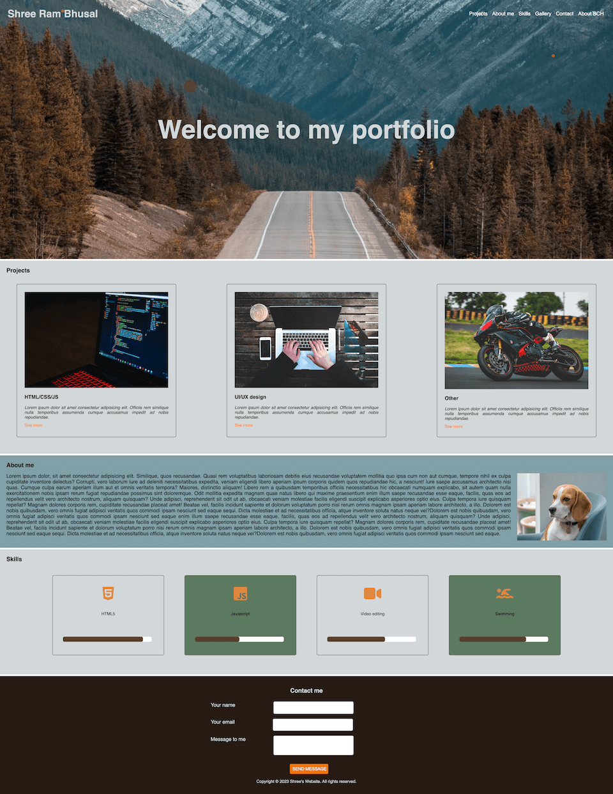
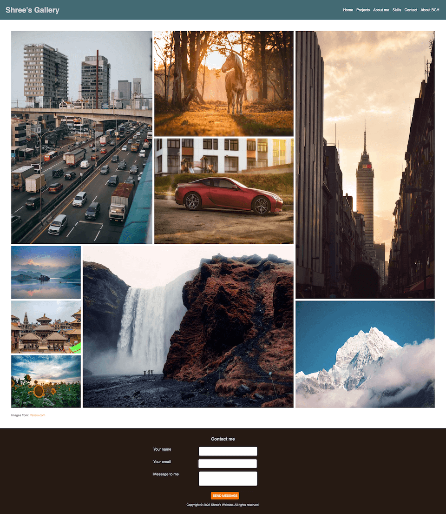
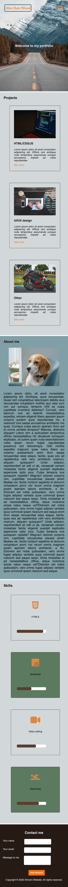
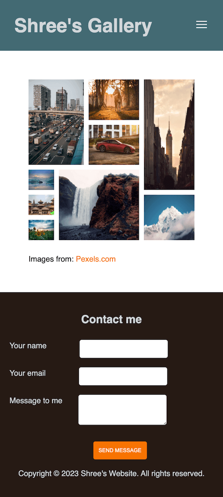

# Project Portfolio

This project is an assignment for the course HTML/CSS. The project has to have clean, optimised and valid code and lighthouse ratings should be green interms of performance, accessibility and best practices . The requirements of this project are as follows.

## Requirements:

Desktop Version:

JS  
-bg color for the header on the scroll 
-back to top button

Hero-banner  
-Fixed header  
-Animated hero-banner, background image fixed (not scrolling), the text is centred horizontally and vertically.

Projects section 
-Three projects with styled cards (hover effects, filters, shadows)

About me section 
-Simple lore ipsum text with image

Skills section 
-Used icons, progress bar and pseudo-classes

Footer section 
-Contact form

Gallery page 
-Separate page with working menu  
-Grid with images, random image sizes

Mobile Version:

-Same as a desktop but working nicely in 375px without horizontal scroll 
-Mobile menu with hamburger 

## Technologies used

Built with: 

- HTML
- CSS
- JS

## Link

Live page [here] https://public.bc.fi/s2300095/shree/PORTFOLIO/gallery.html

## Author

Shree Ram Bhusal
- GitHub @shree0007

## Screenshots
 

  

